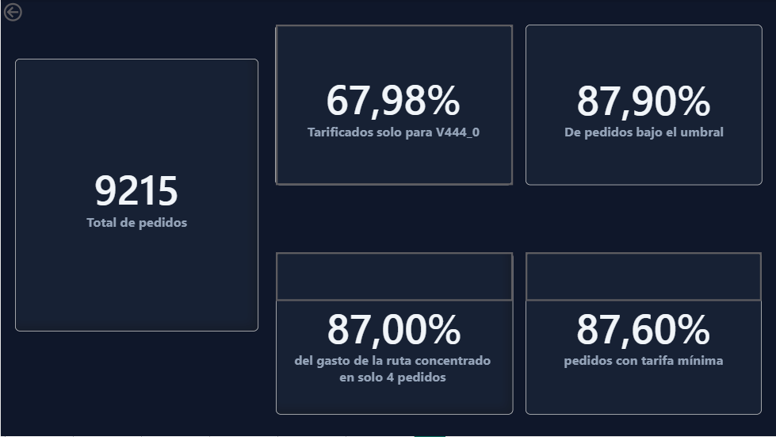

# Logistics Analysis: Cost Optimization

## Objective

The Logistics Director wants to know where the company is losing money. It is necessary to identify specific cost leakages —across routes, carriers, or plants— and provide data-driven recommendations on what to change.

## Executive Summary and Optimization Opportunities

After auditing the transportation and billing data, we have identified the following critical areas for action:

* **Financial blind spot (32% of orders):** We are currently unable to audit 1 out of 3 shipments. The carrier V444_1 has "holes" in its rate charts, which prevents us from controlling the actual cost. We need to request the complete pricing matrix from the carrier. *(Note: Carrier V44_3 presents no risk since the customer manages the shipping).*
* **Opportunity for immediate savings (PORT04 → PORT09 Route):** 87.6% of shipments on this route pay the fixed minimum rate because they are too light (they do not reach the threshold weight). Implementing a batch consolidation strategy will allow us to exceed this threshold and drastically reduce the unit cost.
* **Differentiated strategy for PLANT16 (PORT09 → PORT09 Route):** The unusually high costs on this route are not an inefficiency, but a characteristic of the product. The merchandise from this plant is exceptionally heavy, so I recommend negotiating a dedicated heavy freight strategy exclusively for this plant, separate from standard shipping.

## Tech Stack & Data Quality

* **Databases & SQL:** MySQL (Data modeling, conditional JOINs, and data cleaning).
* **Data Analysis:** Python (Pandas for aggregation, Matplotlib/Seaborn for cost distribution histograms).
* **Data Visualization:** Power BI (Interactive dashboards with integrated static Python visuals).

### Data Cleansing & Processing

The dataset consists of 7 CSV tables. During the initial exploration, opening the `FreightRates` table in Excel caused a regional formatting error (decimals converted to thousands). To prevent data corruption, I bypassed Excel and imported the raw CSV directly into MySQL.

I created a complex conditional `JOIN` between `OrderList` and `FreightRates` using 5 exact match fields plus a weight range condition. However, I found a real ambiguity in the source data where multiple rates matched the same order. To resolve this, I built a flagging system:

1. Calculated how many rate lines actually correspond to each order (0 = no rate, 1 = unambiguous, 2+ = ambiguity).
2. Created a `rate_status` flag to categorize them.

```sql
SELECT rate_status, COUNT(*) AS orders_count
FROM (
    SELECT order_id,
        CASE
            WHEN COUNT(rate) = 0 THEN 'no rate'
            WHEN COUNT(rate) = 1 THEN 'ok'
            ELSE 'ambiguous'
        END AS rate_status
    FROM ordenes_flete_resumen
    GROUP BY order_id
) sub
GROUP BY rate_status;
```

## Full Project Code

You can review the complete scripts and notebooks used for this analysis in the repository folders:
* **SQL:** [Data matching and rate classification script](sql/logistics.sql)
* **Python:** [Cost distribution analysis and EDA notebook](python/02_analisis_logistics.ipynb)

## Dashboard: Supply Chain Insights

*(See the full interactive version by downloading `logistics.pbix` from this repository).*



## Next Steps (Phase 2)

* **Temporal Analysis Expansion:** The current dataset represents a single day of operations (May 26, 2013). We need to request historical data to validate whether the identified routing costs and volume bottlenecks are consistent trends or isolated daily anomalies.
* **Capacity vs. Demand Audit:** Investigate the critical discrepancy where the order volume exceeds the reported daily capacity by up to 70 times. We need to coordinate with the Operations team to confirm whether this is a system measurement error or a real operational bottleneck.
* **VmiCustomers Integration:** Analyze and integrate the isolated VMI customers table to gain full visibility of the distribution network.

-----

# Análisis Logístico: Optimización de Costes

## Objetivos

El director de logística quiere saber dónde la compañía pierde el dinero. Es necesario encontrar puntos de fuga específicos —a través de rutas, transportistas o fábricas— y hacer recomendaciones informadas sobre qué cambiar.

## Resumen Ejecutivo y Oportunidades de Optimización

Tras auditar los datos de transporte y facturación, hemos identificado las siguientes áreas críticas de acción:

* **Punto ciego financiero (32% de los pedidos)**: Actualmente no podemos auditar 1 de cada 3 envíos. El transportista V444_1 presenta "agujeros" en sus escalas de tarifas, lo que nos impide controlar el coste real. Se requiere exigir al proveedor la matriz de precios completa. (Nota: El transportista V44_3 no presenta riesgo ya que el cliente asume la logística).
* **Oportunidad de ahorro inmediato (Ruta PORT04 → PORT09)**: El 87.6% de los envíos en esta ruta pagan la tarifa mínima fija por ser demasiado ligeros (no alcanzan el peso umbral). Implementar una estrategia de consolidación de lotes nos hará pasar esta barrera y reducirá drásticamente el coste unitario.
* **Estrategia diferenciada para PLANT16 (Ruta PORT09 → PORT09)**: Los costes disparados en esta ruta no son una ineficiencia, sino una característica del producto. La mercancía de esta planta es excepcionalmente pesada, por lo que recomiendo negociar una estrategia de transporte pesado exclusiva para esta planta, separada de la paquetería estándar.

## Stack Tecnológico y Calidad de Datos

* **Bases de Datos y SQL**: MySQL (Modelado, JOINs condicionales y limpieza de datos).
* **Análisis de Datos**: Python (Agregaciones y creación de histogramas de distribución de costes).
* **Visualización**: Power BI (Creación de dashboard integrando gráficos estáticos de Python).

## Limpieza y Procesamiento de Datos

El proyecto consta de 7 tablas en formato CSV. Al intentar explorar la tabla FreightRates en Excel, se produjo un error de formato regional (conversión de decimales a miles). Para evitar la corrupción de datos, descarté Excel y procesé el archivo original directamente en MySQL.

En MySQL, diseñé un JOIN condicional complejo entre pedidos y tarifas usando 5 campos de coincidencia exacta y una condición de rango por peso. Sin embargo, detecté una ambigüedad real en los datos originales: varias tarifas coincidían para un mismo pedido. Para solucionarlo, implementé un sistema de clasificación:

1. Calculé cuántas líneas de tarifa correspondían realmente a cada pedido (0 = sin tarifa, 1 = inequívoco, 2+ = ambigüedad).
2. Creé una bandera `rate_status` para categorizarlos mediante la siguiente consulta:

```sql
SELECT rate_status, COUNT(*) AS orders_count
FROM (
    SELECT order_id,
        CASE
            WHEN COUNT(rate) = 0 THEN 'no rate'
            WHEN COUNT(rate) = 1 THEN 'ok'
            ELSE 'ambiguous'
        END AS rate_status
    FROM ordenes_flete_resumen
    GROUP BY order_id
) sub
GROUP BY rate_status;
```

### Código Completo del Proyecto

Puedes revisar los scripts y notebooks completos utilizados para este análisis en las carpetas del repositorio:
* **SQL:** [Script de cruce de datos y clasificación de tarifas](sql/logistics.sql)
* **Python:** [Notebook de análisis de distribución de costes y EDA](python/02_analisis_logistics.ipynb)

## Dashboard: Visualización de la Cadena de Suministro

*(Puedes ver la versión completa descargando el archivo `logistics.pbix` de este repositorio).*


## Próximos Pasos (Fase 2)

* **Expansión del Análisis Temporal:** El dataset actual representa un único día de operaciones (26/05/13). Necesitamos solicitar datos históricos para validar si los costes de ruta y los cuellos de botella identificados son tendencias consistentes o anomalías aisladas.
* **Auditoría de Capacidad vs. Demanda:** Investigar la discrepancia crítica donde el volumen de pedidos supera hasta en 70 veces la capacidad diaria reportada. Es necesario coordinar con Operaciones para confirmar si es un error de medida en el sistema o un cuello de botella real.
* **Integración de VmiCustomers:** Analizar e integrar la tabla aislada de clientes VMI para tener una visión completa de la red de distribución.

